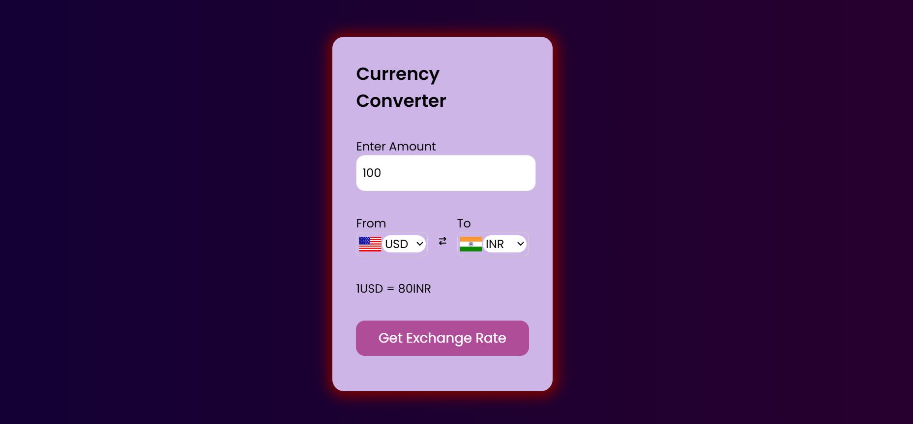

 Currency Converter

A simple and responsive web application that allows users to convert currencies using real-time exchange rates. Built using HTML, CSS, and JavaScript, and powered by a free currency API.

 Live Demo

[👉 View Live App](#)  
*## 🔗 Live Demo

[Click here to view the Currency Converter](https://currency-converter-aimy-alpha.vercel.app/)

---

## 📸 Screenshot

---

 Features

- Convert between any two currencies in real-time
- Uses a free public API for live exchange rates
- Clean and responsive user interface
- No frameworks or libraries used — built with vanilla JavaScript

---

Technologies Used

- HTML
- CSS (Flexbox for layout)
- JavaScript (Fetch API for live data)
- [Fawaz Ahmed Currency API](https://github.com/fawazahmed0/currency-api)

